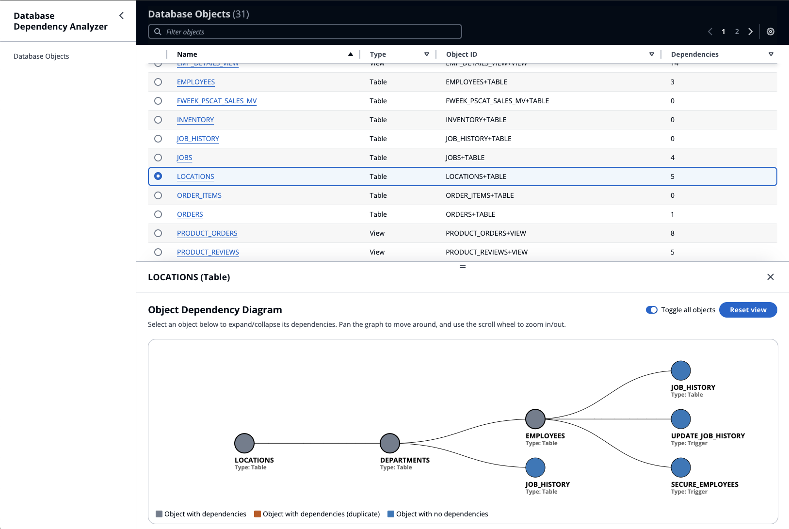
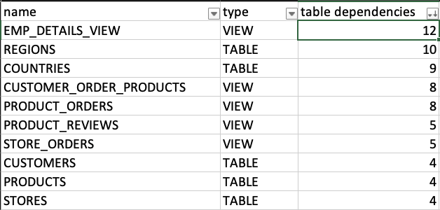

# Database Dependency Analyzer

This project features a command line interface (CLI) tool to analyze database object dependencies within an [Oracle Database](https://www.oracle.com/database/).

Provided with the [required csv output files](#required-csv-output-files), this tool will [construct a graph](#build-graph) of connections between Tables, Views, Packages, Triggers, Functions, Types, Sequences, and Synonyms in your Oracle schema. Then, you can [generage a usage report](#generate-usage-report) of each database object, [review object relationship statistics](#review-database-object-relationship-statistics), or [visualize downstream object dependencies](#view-downstream-dependencies).

Here is an example of how the downstream object dependencies visualizer looks:


## Prerequisites

To run the tool against your own database schema, you will need:

- NodeJS v16+ (v18+ is preferred)
- This project cloned to your local machine
- A connection to your Oracle Database instance ([SQL\*Plus](https://docs.oracle.com/cd/B19306_01/server.102/b14357/qstart.htm) or [SQL Developer](https://www.oracle.com/database/sqldeveloper/) are sufficient)
- Excel (or similar) to open and analyze a CSV file

### Required CSV output files

In order for this tool to build a complete graph of database object dependencies, it needs to be provided with the following CSV files located within the `data/` directory at the root of this project:

- `dependencies.csv`
- `parent_child.csv`
- `tables.csv`
- `trigger_details.csv`
- `views.csv`

The contents of each CSV file above is the output of an PL/SQL query against your Oracle Database instance. You may find examples of these queries under `sample/query-scripts/`:

- [dependencies.sql](./sample/query-scripts/dependencies.sql)
- [parent_child.sql](./sample/query-scripts/parent_child.sql)
- [tables.sql](./sample/query-scripts/tables.sql)
- [trigger_details.sql](./sample/query-scripts/trigger_details.sql)
- [views.sql](./sample/query-scripts/views.sql)

You may find the query to run between the `QUERY START` and `QUERY END` comments in each of the above scripts.

> :memo: You MUST replace refrences to the owners named `'CO', 'HR', 'SH'` with the appropriate owners in your schema. The owners in the sample queries relate to the [Sample Database Analysis Walkthrough section](#sample-database-analysis-walkthrough).

You may use any tool to run these queries and generate the CSV files.

> :warning: You will need to ensure that the `trigger_details.csv` correctly surrounds the multiline `trigger_body` data with quotations. Without proper start and end `"` for that field, the data may not be parsed correctly.

## How to use

### Setup

From a terminal in the root directory of this project, run:

`npx --yes recursive-install --production`

### Build graph

With the [required CSV files](#required-csv-output-files) in the `data/` directory, run:

`npm run analyzer build`

This command will read all of the provided CSV files and generate 3 files:

- `data/nodes.json`: A complete listing of each database object and dependency (used in the [usage report](#generate-usage-report))
- `object_stats.csv`: Database objects statistics for further analysis. See [Review database object relationship statistics](#review-database-object-relationship-statistics)
- `data/visualization_data.json.gz`: Data used by the visualization tool in [View downstream dependencies](#view-downstream-dependencies)

> :warning: Based on your schema size and interdependencies, some of these files may be very large and it may take the process some time to complete.

> :memo: To ensure accuracy, verify that the number of Tables, Views, Parent-Child relationships, Object Dependencies, and Triggers align with your SQL output from the [required CSV files section](#required-csv-output-files).

### Analyze results

Once the graph is built using the analyzer tool, now it's time to review and analyze the results.

#### Generate usage report

From a terminal in the root directory of this project, run:

`npm run analyzer usages <object> [type]`

- `<object>` **REQUIRED** - The name of the database object (table, view, etc.), case insensitive
- `[type]` **OPTIONAL** - The type of the database object. May be one of `TABLE`, `VIEW`, `PACKAGE`, `TRIGGER`, `FUNCTION`, `TYPE`, `SEQUENCE`, or `SYNONYM`

This command will match any database object which starts with the value provided for `<object>`, then show a breakdown of which other objects reference (or use) the database object.

Example output:

```
******************************* START USERS+TABLE *******************************
TABLES(1):    USER_GROUPS
VIEWS(1):     USERS_VIEW
PACKAGES(0):
TRIGGERS(1):  ADD_USER_TRIGGER
FUNCTIONS(0):
TYPES(0):
SEQUENCES(0):
SYNONYMS(0):
******************************* END USERS+TABLE *******************************
```

If multiple database objects matched the `<object>` prefix, then each object's usage details will display one after another in the same command output.

#### Review database object relationship statistics

During the [build graph](#build-graph) process, the `data/object_stats.csv` file was generated.

If you open this file in Excel (or similar), you can sort/filter this data to help understand which database objects have the most dependencies.

For each database object, you will see details on:

Database Object ID:

- **name** - The name of the database object
- **type** - The type of the database object

Database Object Dependencies:

- **table dependencies** - The number of TABLE objects which this directly or indirectly depends on
- **view dependencies** - The number of VIEW objects which this directly or indirectly depends on
- **package dependencies** - The number of PACKAGE objects which this directly or indirectly depends on
- **trigger dependencies** - The number of TRIGGER objects which this directly or indirectly depends on
- **functions/proc dependencies** - The number of FUNCTION objects which this directly or indirectly depends on
- **type dependencies** - The number of TYPE objects which this directly or indirectly depends on
- **sequence dependencies** - The number of SEQUENCE objects which this directly or indirectly depends on
- **synonym dependencies** - The number of SYNONYM objects which this directly or indirectly depends on

Database Object Usages:

- **table usage** - The number of TABLE objects which directly or indirectly depend on this
- **view usage** - The number of VIEW objects which directly or indirectly depend on this
- **package usage** - The number of PACKAGE objects which directly or indirectly depend on this
- **trigger usage** - The number of TRIGGER objects which directly or indirectly depend on this
- **functions/proc usage** - The number of FUNCTION objects which directly or indirectly depend on this
- **type usage** - The number of TYPE objects which directly or indirectly depend on this
- **sequence usage** - The number of SEQUENCE objects which directly or indirectly depend on this
- **synonym usage** - The number of SYNONYM objects which directly or indirectly depend on this

#### View downstream dependencies

From a terminal in the root directory of this project, run:

`npm run view`

This command will startup a lightweight HTTP server on your local machine which you can then use to access the visualizer web page.

A new tab should open in your default web browser showing all of the database objects. Selecting a database object will let you view its dependencies.


In the above image, you can see that the `Countries TABLE` depends on several other tables which in turn have their own dependencies.

To stop the HTTP server, hit `CTRL-C` from the terminal window with the server running.

## Sample Database Analysis Walkthrough

To try out this tool in isolation, this section will walk you through setting up a sample Oracle schema, querying it, then analyzing the results.

The [sample schema](https://github.com/oracle-samples/db-sample-schemas) used here is provided by Oracle as a schema they use for documentation and other illustrations.

The scripts found under the `sample/` folder in this project automate the setup process for the sample schema, thus making it quick to test out the features of this tool.

### Sample prerequisites

In addition to the [above prerequisites](#prerequisites), you will also need:

- Docker (tested using v25+)

### Build and run Docker container

From a terminal in the root directory of this project, run:

`npm run sample:start-sample-db`

This command will perform the following:

1. Download the Oracle sample schema
1. Modify the schema installation scripts to use `password` as the default password and provide defaults for prompts
1. Start a Docker container using a [gvenzl/oracle-free](https://hub.docker.com/r/gvenzl/oracle-free) image

> :warning: The Oracle Database instance here is meant to be used for illustrative purposes only, hence was `password` was set as the password for the root user. **DO NOT** use the Docker container configured in [sample/compose.yml](./sample/compose.yml) for production.

It may take a few minutes for the Docker container to start up and install the sample schema. You may proceed to the next step after you see the following message in the container logs:

```
oracle_sample  | #########################
oracle_sample  | DATABASE IS READY TO USE!
oracle_sample  | #########################
```

### Execute SQL queries

From a **NEW** terminal in the root directory of this project, run:

`npm run sample:execute-queries`

This command will perform the following:

1. Run each query in `sample/query-scripts` to get the [required CSV output files](#required-csv-output-files) and store the CSV files in the `data/` directory
1. Clean up extra spacing in each CSV file as a result of the SQL\*Plus output

> :bulb: If you would like to run your own queries against the Docker container, you can use the command `sqlplus -s system/password@//localhost/sample @<filename>` from within a shell runtime in the Docker container.

Once these queries are executed, you may terminate the Docker container instance by hitting `CTRL-C` from the terminal window with the container running.

### Build sample schema graph

From a terminal in the root directory of this project, run:

`npm run analyzer build`

To learn more about what this command does, review the [build graph](#build-graph) section above.

### Analyze results

You can [generate a usage report](#generate-usage-report) for the `EMPLOYEES` table by running the following command from a terminal:

`npm run analyzer usages EMPLOYEES`

The above command will output:

```
******************************* START EMPLOYEES+TABLE *******************************
TABLES(2):    DEPARTMENTS, JOBS
VIEWS(1):     EMP_DETAILS_VIEW
PACKAGES(0):
TRIGGERS(0):
FUNCTIONS(0):
TYPES(0):
SEQUENCES(0):
SYNONYMS(0):
******************************* END EMPLOYEES+TABLE *******************************
```

This output demonstrates the following:

- 2 tables (`DEPARTMENTS` and `JOBS`) both depend on the `EMPLOYEES` table
- 1 view (`EMP_DETAILS_VIEW`) depends on the `EMPLOYEES` table

You can [review database object relationship statistics](#review-database-object-relationship-statistics) by inspecting the generated [object_stats.csv](./data/object_stats.csv) file.

By leveraging sorting and filtering in Excel, you can see that the `EMP_DETAILS_VIEW` view has the most table dependencies out of all the database objects.



To [visualize the dependencies](#view-downstream-dependencies) for a database object, runn the following command from a terminal:

`npm run view`

In the opened web page, select `LOCATIONS` from the table to see all of its dependencies:


